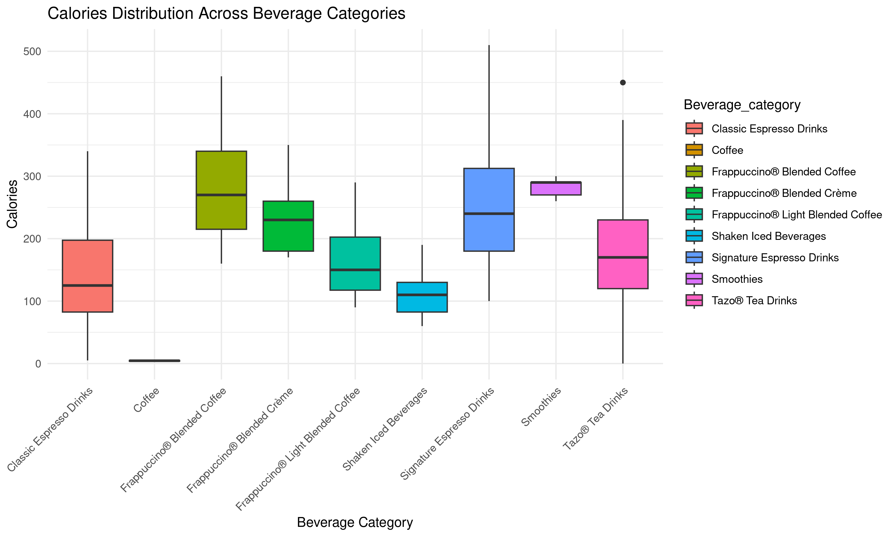

```{r setup, include=FALSE}
knitr::opts_chunk$set(echo=FALSE, warning = FALSE, message = FALSE)
```

```{r, load-data}
here::i_am("final_project_starbucks.Rmd")
data <- readRDS(
  file = here::here("output/data_clean.rds")
)
```

# 1. Introduction & Objectives

This project focuses on analyzing the nutritional composition of Starbucks beverages, exploring the relationship between certain variables, and classifying the beverages as healthy, which provides actionable insights for consumers and contributes to a broader discussion of dietary health.

This dataset, sourced from Kaggle, contains 241 cleaned observations across 18 variables, categorizing various beverages such as coffee, tea, and smoothies. Key categorical variables include Beverage category, Beverage name, and Beverage preparation, while numerical variables provide nutritional details like Calories, Sugars, Total Fat, Trans Fat, Saturated Fat, Sodium, Total Carbohydrates, Cholesterol, and Caffeine content.

# 2. Descriptive analysis

## Tabular analysis

The following table shows the descriptive statistics of the calorie, sugar and fat content of the 9 beverage categories.

```{r, Tabular-Analysis}
library(kableExtra)

# Load the summary table
summary_table <- readRDS(
  file = here::here("output", "table_summary.rds")
)

# Formatting
kable(summary_table, format = "html", 
      caption = "Summary of Starbucks Beverages by Category") %>%
  kable_styling(bootstrap_options = c("striped", "hover", "condensed"),
                full_width = FALSE) %>%
  column_spec(1, bold = TRUE) %>%
  add_header_above(c(" " = 1, "Count" = 1, "Calories Stats" = 6, "Sugar Stats" = 6, "Fat Stats" = 6))
```

## Top 5 Beverages with the Most Calories

```{r, Top-5-Calories}
# Load top 5 calories data
top5_calories <- readRDS("output/top5_calories.rds")

# Display the data
print(top5_calories)
```

# 3. Graphical analysis

The box plot illustrates the calorie distribution across different beverage categories, showing significant variation among them. Frappuccino® Blended Coffee and Signature Espresso Drinks have the highest calorie content, with a broad range and several outliers, while Coffee and Shaken Iced Beverages contain the fewest calories with minimal variation. Smoothies and Tazo® Tea Drinks fall in the mid-to-high range, though their spread is more contained. The presence of outliers in some categories indicates certain beverages with exceptionally high caloric values. Overall, blended and espresso-based drinks tend to be more calorie-dense, whereas coffee and iced beverages are lower-calorie options.

```{r, Graphical-Analysis, fig.align='center', out.width= "800px"}
# We'll include the pre-generated plot

```
